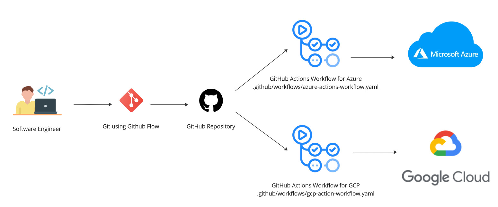
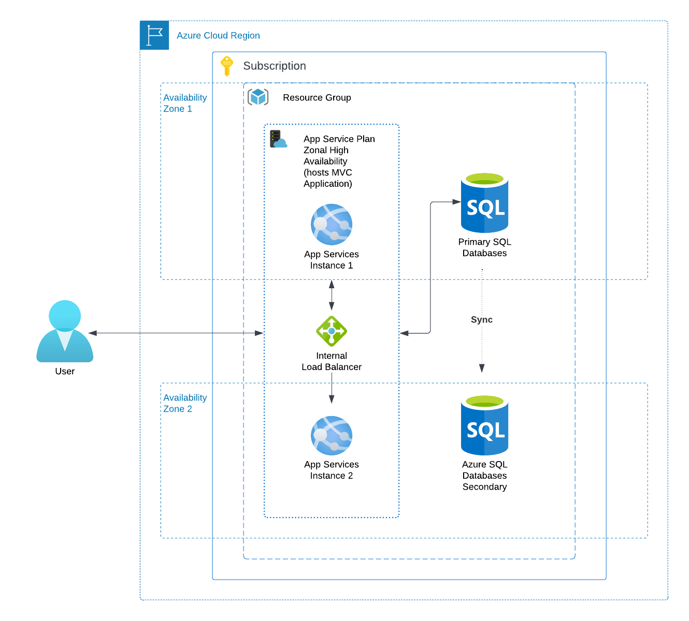

One of the core business tenets is business agility - the ability to adapt to changing market conditions. Similarly, businesses must be agile and must ensure availability through business continuity best practices.  Business either change or die.  How does this affect cloud in particular? 

# Let's Dive Deeper
In general, a modular, cloud-agnostic, application that follows the 12 factor methodology can provide business agility, continuity, scalability and cost efficiency.  Below I demonstrate avoiding vendor lock-in while using PaaS with an array of architectures.  Though similar principles apply to XaaS (read "any"-as-a-Service). A modern web application is built using a modern cross-platform programming language, such as ASP.NET 7 MVC, which can run on any system - Linux based or Windows based.  One can either take a code-first or database-first approach.  This choice will largely depend on the size of the application and enterprise or team complexity - smaller teams may benefit from code-first, but larger teams often must follow strict change management processes, which require a database-first approach.  The below diagrams show a systematic approach to design such a modern web-app.  More detail and sample code can be found in my GitHub repo found here: [GitHub Platform Agnostic App](https://github.com/rimlaban7/platform-agnostic-app). 

# Architecture Diagrams

### Logical Architecture using MVC Pattern
{:class="img-responsive"}

### CI/CD
{:class="img-responsive"}

### Microsoft Azure Physical Architecture
{:class="img-responsive"}

### Google Cloud Platform Architecture
{:class="img-responsive"}
