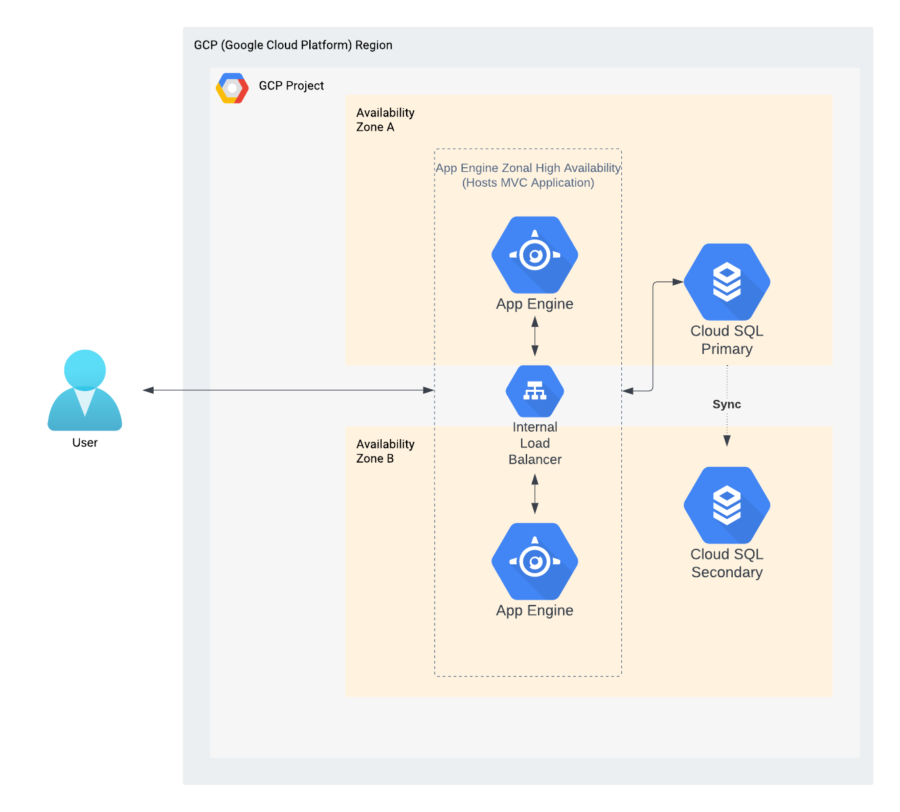

One of the core business tenets is business agility - the ability to adapt to changing market conditions. Similarly, businesses must be agile and must ensure availability through business continuity best practices.  Business either change or die.  How does this affect cloud in particular? 

In general, a modular, cloud-agnostic, application that follows the 12 factor methodology can provide business agility, continuity, scalability and cost efficiency.  Below I demonstrate avoiding vendor lock-in while using PaaS with an array of architectures.  Though similar principles apply to XaaS (read "any"-as-a-Service). A modern web application is built using a modern cross-platform programming language, such as ASP.NET 7 MVC, which can run on any system - Linux based or Windows based.  One can either take a code-first or database-first approach.  This choice will largely depend on the size of the application and enterprise or team complexity - smaller teams may benefit from code-first, but larger teams often must follow strict change management processes, which require a database-first approach.  The below diagrams show a systematic approach to design such a modern web-app.  More detail and sample code can be found in my GitHub repo found here: [GitHub Platform Agnostic App](https://github.com/rimlaban7/platform-agnostic-app). 

# Architecture Diagrams

## Logical Architecture using MVC Pattern
{:class="img-responsive"}

## Google Cloud Platform Architecture
{:class="img-responsive"}

## Microsoft Azure Physical Architecture
{:class="img-responsive"}

# CI/CD with GitHub Actions
{:class="img-responsive"}

 
## GitHub Actions for Microsoft Azure
 

name: GitHub Actions for Azure

env:
  AZURE_WEBAPP_NAME: friendly-octo-giggle   # set this to your application's name
  AZURE_WEBAPP_PACKAGE_PATH: '.'      # set this to the path to your web app project, defaults to the repository root
  DOTNET_VERSION: '6.0.x'                 # set this to the .NET Core version to use

on: 
  workflow_dispatch:
    inputs:
      logLevel:
        description: 'Log level'     
        required: true
        default: 'warning'
        
jobs:
  build:
    runs-on: ubuntu-latest
    
    steps:
      - uses: actions/checkout@v4

      - name: Set up .NET Core
        uses: actions/setup-dotnet@v3
        with:
          dotnet-version: ${{ env.DOTNET_VERSION }}

      #substitute production appsettings entries to appsettings json file
      - name: App Settings Variable Substitution
        uses: microsoft/variable-substitution@v1
        with:
          files: './BethanysPieShop/appsettings.json'
        env:
          ConnectionStrings.BethanysPieShopDbContextConnection: ${{ secrets.AZURE_DB_CONNECTION_STRING }}
          
      - name: Build with dotnet
        run: dotnet build --configuration Release

      - name: dotnet publish
        run: dotnet publish -c Release -o ${{env.DOTNET_ROOT}}/myapp

      - name: Upload artifact for deployment job
        uses: actions/upload-artifact@v3
        with:
          name: .net-app
          path: ${{env.DOTNET_ROOT}}/myapp    

  deploy:
    runs-on: ubuntu-latest
    needs: build
    environment:
      name: 'production'
      url: ${{ steps.deploy-to-webapp.outputs.webapp-url }}

    steps:
      - name: Download artifact from build job
        uses: actions/download-artifact@v3
        with:
          name: .net-app
          
      - name: Deploy to Azure Web App
        id: deploy-to-webapp
        uses: azure/webapps-deploy@v2
        with:
          app-name: ${{ env.AZURE_WEBAPP_NAME }}
          publish-profile: ${{ secrets.AZURE_WEBAPP_PUBLISH_PROFILE }}
          package: ${{ env.AZURE_WEBAPP_PACKAGE_PATH }}


 
## GitHub Actions for Google Cloud Platform
 

name: GitHub Actions for GCP

on: 
  workflow_dispatch:
    inputs:
      logLevel:
        description: 'Log level'     
        required: true
        default: 'warning'

jobs:
  build:
    runs-on: ubuntu-latest

    steps:
      - uses: actions/checkout@v4

      # Substitute production appsettings entries to appsettings json file
      - name: App Settings Variable Substitution
        uses: microsoft/variable-substitution@v1
        with:
          files: './BethanysPieShop/appsettings.json'
        env:
          ConnectionStrings.BethanysPieShopDbContextConnection: ${{ secrets.GCP_DB_CONNECTION_STRING }}

      - id: 'auth'
        name: Authenticate to Google Cloud
        uses: 'google-github-actions/auth@v1'
        with:
          credentials_json: '${{ secrets.GCP_CREDENTIALS }}'
          
      - name: 'Set up Google Cloud SDK'
        uses: 'google-github-actions/setup-gcloud@v1'
          
      - name: Deploy to App Engine
        run: gcloud app deploy ./BethanysPieShop/app.yaml


